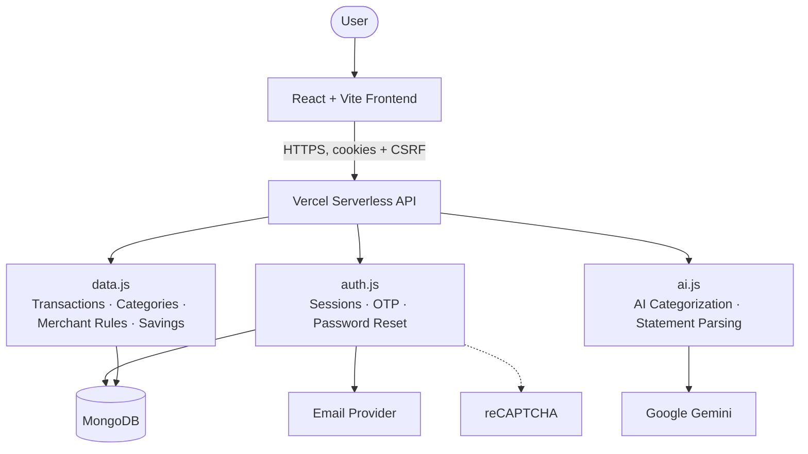

# CashCanvas

CashCanvas is a personal finance app that turns uploaded bank statements into categorized,
searchable transaction history with spending insights.

## What It Does

- Upload bank statements (CSV or PDF) to import transactions
- Automatically categorize transactions using keyword matching, with Google Gemini as an AI
  fallback for anything unmatched
- Learn from corrections — reassigning a transaction's category creates a merchant rule that
  applies automatically next time
- Create custom categories with your own keywords
- Track spending with dashboard and analytics views (charts and breakdowns by category)
- Set a savings goal and get a suggested category cut-plan
- Export transaction history to CSV

## Live App

[https://cashcanvas.dev](https://cashcanvas.dev)

## Tech Stack

- React + Vite
- Node.js / Vercel Serverless Functions
- MongoDB
- Google Gemini (AI-assisted categorization)
- Playwright + Vitest (testing)

## Architecture



The frontend only ever talks to the Vercel API — never directly to MongoDB, Gemini, or the
email provider. Auth uses short-lived JWT access tokens plus rotating refresh-token sessions in
HttpOnly cookies, with a CSRF token protecting state-changing requests. See
[`docs/architecture.md`](docs/architecture.md) for how categorization, file processing, and
each piece above actually work.

## Getting Started

Requires Node.js 22+ and a MongoDB connection string (local or [Atlas](https://www.mongodb.com/atlas)).

```bash
git clone https://github.com/Param-1210/CashCanvas.git
cd CashCanvas
npm ci
cp .env.example .env   # set MONGODB_URI at minimum
npm run dev:full        # frontend on :5173, API on :3001
```

Everything else in `.env.example` (Gemini, reCAPTCHA, email) is optional in development.

## Testing

```bash
npm test          # unit/component tests (Vitest)
npm run test:e2e  # end-to-end tests (Playwright)
```

## Documentation

- [`CONTRIBUTING.md`](CONTRIBUTING.md) — local setup, testing, and PR workflow
- [`docs/architecture.md`](docs/architecture.md) — how the frontend, API, and each service fit together
- [`docs/backend/authentication.md`](docs/backend/authentication.md) — authentication and session architecture
- [`docs/backend/database.md`](docs/backend/database.md) — database schema and design

## Project Status

CashCanvas is actively developed and deployed at [cashcanvas.dev](https://cashcanvas.dev).
