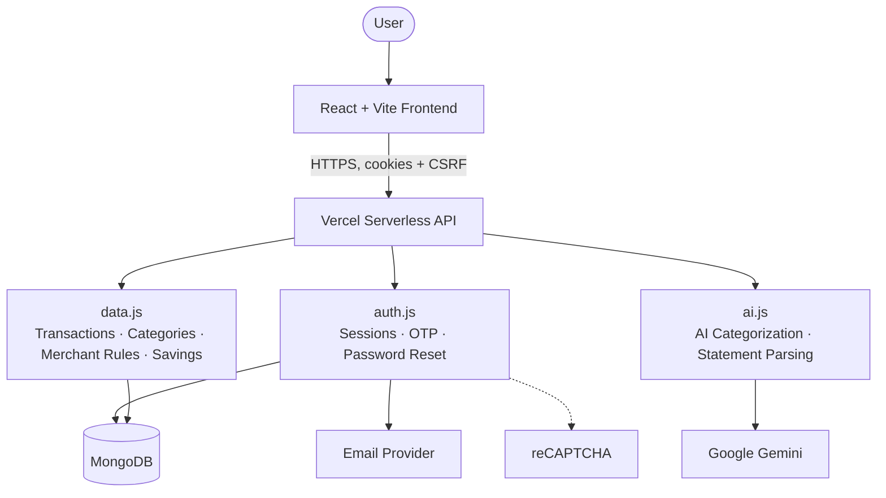
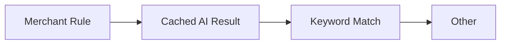

# Architecture

CashCanvas is a React single-page app backed by 3 Vercel Serverless Functions and MongoDB,
with Google Gemini, an email provider, and reCAPTCHA as the only external services.

### Frontend

React + Vite single-page app, no router library — a handful of top-level screens
(`AuthScreen`, `UploadScreen`, `Dashboard`) swapped based on local state. Every request to the
API goes through one shared `fetch` wrapper (`src/api.js`) that always sends credentials and a
CSRF header.

### API

3 real Vercel Serverless Functions — `api/auth.js`, `api/data.js`, `api/ai.js`. Everything
else under `api/_lib/` is a shared helper module, not an independently-routable function. The
same handler modules run locally under a thin Express bootstrap (`server.js`), so local dev and
production never drift.

### Authentication

Login/signup issue a short-lived JWT access token and a rotating opaque refresh token, both set
as HttpOnly cookies, plus a separate non-HttpOnly cookie carrying a CSRF token that's echoed
back as a header on every mutating request. Signup is additionally gated by reCAPTCHA v3,
verified server-side. Sessions live in MongoDB, one document per logged-in device.

### Data

MongoDB stores: `users`, `pending_signups` (OTP-gated signups not yet promoted to a user
account), `sessions`, `uploaded_files` (statements, with their transactions embedded),
`custom_categories`, `merchant_category_rules`, and `savings_goals`.

### Categorization

A transaction's displayed category is resolved with a fixed precedence — the first match wins:

- **Merchant Rule** — created automatically when a user corrects a transaction's category;
  always wins once one exists for that merchant.
- **Cached AI Result** — set when the user runs "categorize with AI" on the dashboard:
  uncategorized transactions are matched against merchant rules first, then whatever's left is
  sent to Gemini.
- **Keyword Match** — a bundled keyword list per category (plus any custom categories), applied
  automatically to any transaction with no rule or AI result.
- **Other** — nothing matched.

### File Processing

CSV statements are parsed entirely client-side (`papaparse`) — the raw file never reaches the
server, only the parsed transaction array does. PDF statements are sent to `/api/parse-pdf`,
which checks the `%PDF` magic number, then asks Gemini to extract transactions directly from
the file.

### External Services

- **MongoDB Atlas** — the only database, one connection shared across serverless invocations.
- **Google Gemini** (`gemini-1.5-flash`) — AI transaction categorization and PDF statement
  parsing.
- **Email provider** — Gmail SMTP by default, or Resend (`EMAIL_PROVIDER` env var) — sends OTP,
  verification, and password-reset emails. Optional in development; the app auto-verifies users
  when it isn't configured.
- **reCAPTCHA v3** — bot protection on signup, verified server-side.
- **Vercel** — hosts both the frontend build and the 3 serverless functions; deploys
  automatically on every push to `main`.
